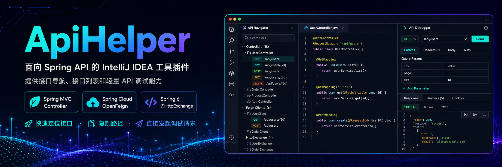

<p align="center">
  
</p>

<p align="center">
  <a href="https://plugins.jetbrains.com/plugin/32327-apihelper"></a>
  <a href="https://plugins.jetbrains.com/plugin/32327-apihelper"></a>
  <a href="https://github.com/sxhjlzl/api-helper/blob/main/LICENSE"></a>
  <a href="https://github.com/sxhjlzl/api-helper/stargazers"></a>
</p>

<p align="center">
  <a href="https://plugins.jetbrains.com/plugin/32327-apihelper">插件市场</a>
  ·
  <a href="https://github.com/sxhjlzl/api-helper/issues">反馈问题</a>
  ·
  <a href="./README_en.md">English</a>
</p>

ApiHelper 支持 Spring MVC Controller、Spring Cloud OpenFeign 以及 Spring 6 `@HttpExchange` 声明式 HTTP 客户端，适合在日常开发中快速定位接口、复制路径并直接发起调试请求。

## 为什么需要 ApiHelper

在 Spring 项目里，接口相关操作经常分散在多个地方：Controller、Feign Client、配置文件、接口文档、调试工具和全局搜索。ApiHelper 把这些高频动作收回到 IDEA 里：

- 从客户端声明快速跳到 Controller。
- 从 Controller 反向找到调用方声明。
- 直接复制解析后的接口 URL。
- 在工具窗口里集中浏览项目接口。
- 对接口发起一次轻量调试请求。

## 功能

- `@FeignClient` / `@HttpExchange` 接口方法与 `@RestController` 方法双向 gutter 跳转
- gutter 右键复制解析后的接口 URL
- ApiHelper 工具窗口集中展示 Controller 与 Feign / HttpExchange 端点
- 支持搜索、展开、收起、右键调试接口、右键复制 URL
- 内置轻量 API 调试页，支持 Query、Path、Header、Cookie 和多种 Body 类型
- 支持 JSON 响应自动格式化
- 自动解析 Spring 配置中的 context-path、servlet path、profile 与占位符
- 基于 UAST 同时支持 Java 与 Kotlin
- 中英双语界面

## 预览

| 双向导航 | 工具窗口 | 轻量调试 |
| --- | --- | --- |
| Feign / HttpExchange 与 Controller 互相跳转 | 集中展示 Controller 与客户端接口 | 在 IDEA 内快速验证接口响应 |

## 安装

插件已上架 JetBrains Marketplace：[ApiHelper - JetBrains Marketplace](https://plugins.jetbrains.com/plugin/32327-apihelper)

也可以在 IDEA 中选择 `Settings` -> `Plugins`，搜索 `ApiHelper` 后直接安装。

本地安装：

```bash
./gradlew :buildPlugin
```

构建产物位于：

```text
build/distributions/api-helper-<version>.zip
```

在 IDEA 中选择 `Settings` -> `Plugins` -> `Install Plugin from Disk...` 安装该 zip。

## 使用

打开带有 Spring Web、OpenFeign 或 `@HttpExchange` 注解的项目后，ApiHelper 会异步扫描端点并预热缓存。

- 在编辑器 gutter 中点击箭头可跳转到对端接口。
- 右键 gutter 可复制解析后的 URL。
- 打开右侧 `ApiHelper` 工具窗口，可浏览接口列表或切换到调试页。
- 在接口列表中右键具体接口，可调试、跳转对端或复制 URL。

## 设置

路径：`Settings` -> `Tools` -> `ApiHelper`

可手动指定 Spring active profile。留空时插件会尝试从项目配置中自动推断。

## 兼容性

| 项 | 说明 |
| --- | --- |
| 目标 IDE | IntelliJ IDEA 2024.3+ |
| 依赖插件 | Java、Kotlin |
| 支持源码 | Java、Kotlin |
| 支持框架 | Spring MVC、Spring Cloud OpenFeign、Spring 6 `@HttpExchange` |

## 开发

```bash
./gradlew :compileKotlin
./gradlew :test
./gradlew :check
./gradlew :buildPlugin
./gradlew :runIde
```

技术栈：

- Kotlin 2.3.20
- JDK 21
- Gradle 9.5.0
- IntelliJ Platform Gradle Plugin 2.12.0
- Target IDE: IntelliJ IDEA 2024.3+

## 项目结构

```text
src/main/kotlin/com/lizhuolun/apihelper/
  cache/        缓存服务
  config/       Spring 配置读取与占位符解析
  core/         HTTP 映射模型与注解解析
  listener/     启动预热与 PSI 监听
  provider/     gutter 图标与导航
  scanner/      端点扫描
  settings/     设置页与持久化配置
  ui/           工具窗口、接口树与调试面板

src/main/resources/
  META-INF/plugin.xml
  icons/
  messages/
```

## 版本

当前版本：`1.0.0`

## 反馈与支持

欢迎下载使用，也欢迎通过 [GitHub Issues](https://github.com/sxhjlzl/api-helper/issues) 提出建议或反馈问题。如果 ApiHelper 对你有帮助，欢迎给项目点一个 Star。
